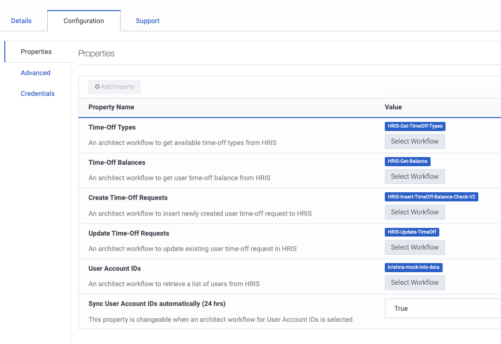
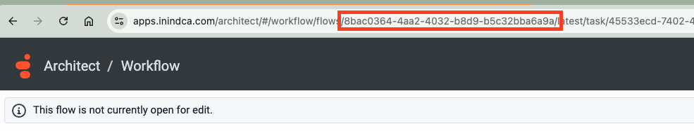

:::{"alert":"primary","title":"About Genesys Cloud Blueprints","autoCollapse":false} 
Genesys Cloud blueprints were built to help you jump-start building an application or integrating with a third-party partner. 
Blueprints are meant to outline how to build and deploy your solutions, not a production-ready turn-key solution.
 
For more information about Genesys Cloud blueprint support and practices, see our Genesys Cloud blueprint [FAQ](https://developer.genesys.cloud/blueprints/faq "Opens the Blueprint FAQ") sheet.
:::

This Genesys Cloud Developer Blueprint integrates Genesys Cloud with an HRIS to retrieve employee time-off balances and provide that information in Genesys Cloud workforce management. When a time-off request is created or updated in Genesys Cloud workforce management, the integration inserts the request into the HRIS for tracking and verification against the employee's available balance.

You can configure and run this integration from within your Genesys Cloud organization. Architect flows and data actions to sync time-off data with your preferred HRIS. The following image shows a BambooHR integration.


## Solution components

* **Genesys Cloud CX** - A suite of Genesys cloud services for enterprise-grade communications, collaboration, and contact center management. This solution uses Genesys Cloud Architect, integrations and data actions to sync time-off requests and time-off balances with the HRIS.
* **3rd-party HRIS that supports JSON posts to a REST API endpoint** - The integration requires external API access from Genesys Cloud to an HRIS. This blueprint uses BambooHR as an example.

## Prerequisites

### Specialized knowledge

* Experience designing Architect flows
* Experience using the Genesys Cloud Platform API
* Experience with REST API authentication
* Experience with JSON requests
* An understanding of how to use data actions
* Experience with the HRIS you use with this solution, including its time-off features and its API

### HRIS account with API access

Use JSON-based REST APIs to configure an HRIS account in order to provide limited and secure access to its data. 

Genesys Cloud workforce management integration needs sufficient API access to complete the following tasks:
  * Get a list of configured time-off types
  * Get a list of agents whose time-off data is synced by the integration
  * Get an HRIS agent-unique key or ID 
  * Map the email address of a user in the HRIS to the corresponding agent in Genesys Cloud
  * Retrieve information about agents' time-off balance on requested dates, for specific types of time-off 
  * Insert an agent's time-off request 
  * Modify and delete previously inserted agent time-off requests 

### Genesys Cloud account requirements

* One of the following Genesys Cloud licenses. For more information, see [Genesys Cloud Pricing](https://www.genesys.com/pricing "Opens the Genesys Cloud Pricing article") in the Genesys website.
  * Genesys Cloud CX 3
  * Genesys Cloud CX 3 Digital
  * Genesys Cloud CX 1 WEM Upgrade 2
  * Genesys Cloud CX 2 WEM Upgrade 1
  * Genesys Cloud EX
* The Master Admin role in Genesys Cloud. For more information, see [Roles and permissions overview](https://help.mypurecloud.com/?p=24360 "Opens the Roles and permissions overview article") in the Genesys Cloud Resource Center.

For more information, see [Roles and permissions overview](https://help.mypurecloud.com/articles/about-roles-permissions/ "Opens the Roles and permissions overview article") in the Genesys Cloud Resource Center.

## Solution architecture

This solution is based on Architect flows, which are activated by Genesys Cloud Workforce Management application. The flows use data actions to get or modify HRIS data. You can also build additional logic into the flows to manipulate HRIS data however you like.

Credentials stored in the integration's configuration are used to authorize data actions to access the specified route of the HRIS JSON REST API endpoint.

### Example Architect flows

The integration provides the following examples of Architect flows:

* [HRIS-Get-Agents flow](#hris-get-agents-flow "Goes to the HRIS-Get-Agents flow section")
* [HRIS-Get-Timeoff-Types flow](#hris-get-timeoff-types-flow "Goes to the HRIS-Get-Timeoff-Types section")
* [HRIS-Get-Balance flow](#hris-get-balance-flow "Goes to the HRIS-Get-Balance flow section")
* [HRIS-Insert-TimeOff flow](#hris-insert-timeoff-flow "Goes to the HRIS-Insert-TimeOff flow section")
* [HRIS-Update-TimeOff flow](#hris-update-timeoff-flow "Goes to the HRIS-Update-TimeOff flow section")

:::primary
**Note** These flows can be updated as needed for your specific business purposes.
:::

### HRIS-Get-Agents flow

The purpose of this workflow is to to provide unique ids of agents in external HRIS system together with their emails, according to which these agents can be mapped to the user records in Genesys Cloud. 

This workflow is expected to return a list of emailIds and associated externalIds of the agents from external HRIS system that is to be synchronized with Genesys users. 

The number of records in both lists should match. The list order is important as the system will use the order to match elements in list of ids with the list of emails.

The email ID of a given agent configured in external HRIS system should match to that of the user defined in Genesys and that is the key based on which the agents in two systems are integrated.

The flow does not have need a input parameter and the out of the workflow would be a list of emailId and externalId both of which are string data types. Below is a table showing that information.

Note that a workflow variable can only have up to 2000 entries maximum and hence to facilitate that there are 25 buckets of emails and externalIds provided to send up 50K agent details.
The indexed of additional buckets start from 1 through 24 in addition to the initial bucket. 

The workflow is assigned to the WFM Integration configuration property of "User Account IDs" that has a description of "An architect workflow to retrieve a list of users from HRIS". This will ensure the workflow
is triggered as part of scheduled agent synchronization process.

| Name               | Type   |           Data Type           | Notes                                       | Mandatory |
|:-------------------|:-------|:-----------------------------:|:--------------------------------------------|:----------|
| Flow.statusCode    | Output | HTTP status code <br/>Integer | Less than 300 if success                    | Yes       |
| Flow.status        | Output |            String             | Set 'Complete' if success                   | Yes       |
| Flow.errorMsg      | Output |            String             | Message describing the error if not success | No        |
| Flow.emails        | Output |         String Array          | Maximum of 2000 strings                     | Yes       |
| Flow.externalIds   | Output |         String Array          | Maximum of 2000 strings                     | Yes       |
| Flow.emails1       | Output |         String Array          | Next bucket for 2000 emails                 | No        |
| Flow.externalIds1  | Output |         String Array          | Next bucket for 2000 externalIds            | No        |
| ..                 | ..     |              ..               | ..                                          |           |
| Flow.emails24      | Output |         String Array          | Next bucket for 2000 emails                 | No        |
| Flow.externalIds24 | Output |         String Array          | Next bucket for 2000 externalIds            | No        |

### HRIS-Get-Timeoff-Types flow

This flow receives a list of all time-off types from the HRIS. The time-off type consists of an ID/key, a name, and an optional secondary ID. Genesys Cloud workforce management sends this info back to the HRIS when it checks an agent's time-off balance or inserts or modifies time-off requests.

You can use the optional secondary ID if a single ID does not sufficiently identify a time-off type and its accrual rule in the HRIS. There's also an optional secondary ID that stores additional time-off type information.

When Genesys Cloud workforce management checks an agent's time-off balance or inserts or modifies a time-off request, it passes the secondary ID back to the HRIS.

Bamboo HRIS doesn't use secondary Ids.

| Name               | Type   |           Data Type           | Notes                                       | Mandatory |
|:-------------------|:-------|:-----------------------------:|:--------------------------------------------|:----------|
| Flow.statusCode    | Output | HTTP status code <br/>Integer | Less than 300 if success                    | Yes       |
| Flow.status        | Output |            String             | Set 'Complete' if success                   | Yes       |
| Flow.errorMsg      | Output |            String             | Message describing the error if not success | No        |
| Flow.ids           | Output |         String Array          | Maximum of 2000 strings                     | Yes       |
| Flow.names         | Output |         String Array          | Maximum of 2000 strings                     | No        |
| Flow.id2s          | Outpit |         String Array          | Maximum of 2000 strings                     | No        |


### HRIS-Get-Balance flow

An agent's time-off balances is received in this flow. Multi-day and multi-time-off balance information are retrieved.

| Name               | Type   |           Data Type           | Notes                                       | Mandatory |
|:-------------------|:-------|:-----------------------------:|:--------------------------------------------|:----------|
| Flow.statusCode    | Output | HTTP status code <br/>Integer | Less than 300 if success                    | Yes       |
| Flow.status        | Output |            String             | Set 'Complete' if success                   | Yes       |
| Flow.errorMsg      | Output |            String             | Message describing the error if not success | No        |
| Flow.balanceMinutesPerDay           | Output |         String Array          | Maximum of 2000 strings                     | Yes       |
| Flow.timeOffTypeIds         | Output |         String Array          | Maximum of 2000 strings                     | Yes        |
| Flow.dates          | Outpit |         String Array          | Maximum of 2000 strings                     | Yes        |


### HRIS-Insert-TimeOff flow

This flow inserts a new time-off request into the HRIS. The request contains the following information:

* Agent ID
* Earliest time-off request date
* Latest time-off request date
* Average amount of time-off minutes (hours) per time-off day
* List of time-off days containing a date
* Amount of time-off minutes per day

:::primary
**Note**
Time-off requests are only propagated if approved by Genesys Cloud workforce management.
:::
| Name               | Type   |           Data Type           | Notes                                       | Mandatory |
|:-------------------|:-------|:-----------------------------:|:--------------------------------------------|:----------|
| Flow.statusCode    | Output | HTTP status code <br/>Integer | Less than 300 if success                    | Yes       |
| Flow.status        | Output |            String             | Set 'Complete' if success                   | Yes       |
| Flow.errorMsg      | Output |            String             | Message describing the error if not success | No        |
| Flow.timeOffRequestId           | Output |         String         | Timeoff request number                    | Yes       |


### HRIS-Update-TimeOff flow

The corresponding information in WFM changes when a time-off record in the HRIS is updated. This request contains the following information:

* Agent ID
* HRIS time-off request ID
* New time-off status
* Earliest time-off request date
* Latest time-off request date
* Average amount of time-off minutes (hours) per time-off day
* List of time-off days containing a date
* Amount of time-off minutes per day
* Previous time-off id

:::primary
**Note** HRIS time-off request IDs are updated or replaced based on whether an existing record is updated or replaced.
:::
| Name               | Type   |           Data Type           | Notes                                       | Mandatory |
|:-------------------|:-------|:-----------------------------:|:--------------------------------------------|:----------|
| Flow.statusCode    | Output | HTTP status code <br/>Integer | Less than 300 if success                    | Yes       |
| Flow.status        | Output |            String             | Set 'Complete' if success                   | Yes       |
| Flow.errorMsg      | Output |            String             | Message describing the error if not success | No        |
| Flow.timeOffRequestId           | Output |         String         | Timeoff request number                    | Yes       |


### Example data actions

Integration provides data actions in the following examples:

* **Bamboo-Get-TimeOff-Types** - The HRIS provides a list of time off types in this data action.
* **Bamboo-Get-Employees** - Obtains the employee list from the HRIS.
* **Bamboo-Get-Balance** - Estimates the time-off balance of an employee in the HRIS. The example uses the "v1/employees/{employeeId}/time_off/calculator" route of BambooHR HRIS, which returns a rounded balance to one decimal point.
* **Bamboo-Put-TimeOff-Request** - Inserts a time-off request from Genesys Cloud into the HRIS. Both the ### HRIS-Insert-TimeOff flow and the HRIS-Update-TimeOff flow use this data action.

:::primary
**Note** Once imported into Genesys Cloud, these data actions can be updated to meet your specific business needs.
:::

## Implementation steps

### Clone the GitHub repository

:::primary
**Note**: The GitHub repository should only be cloned if you plan to use the example flows and data actions that integrate with BambooHR HRIS. Otherwise, modify the example files or skip this step. You can create data actions and flows directly in your Genesys Cloud organization.
:::

Clone the [wfm-hris-blueprint](https://github.com/GenesysCloudBlueprints/wfm-hris-blueprint) repository to your local machine. The examples folder contains the Architect flows that can be modified to meet your needs.

### Create the integration for data actions

Add a web services data actions integration to Genesys Cloud to enable communication with your HRIS:

1. In Genesys Cloud, navigate to **Admin** > **Integrations** and install a **Web Services Data Actions** integration from Genesys Cloud. For more information, see [About the data actions integrations](https://help.mypurecloud.com/?p=209478 "Opens the data actions overview article") in the Genesys Cloud Resource Center.

  

2. Rename the web services data action integration and provide a short description.
3. Click **Configuration** > **Credentials** and then click **Configure**.

   

4. From the **Credential Type** list, select **User Defined (OAuth)** and configure the credentials to access your HRIS.
5. Click **Save**.

### Create the data actions

This solution provides [example data actions](#example-data-actions "Goes to the Example data actions section"). Data actions are performed using JSON API calls to the HRIS. A specific API route is configured for each data action, which exchanges specific HRIS data.

Follow the same instructions for each of these data actions or the newly created data actions.

:::primary
**Note**
These instructions demonstrate how to use the example data actions in the blueprint solution. The steps you need to follow depend on your HRIS.
:::

1. In Genesys Cloud, navigate to **Admin** > **Integrations** > **Actions**.
2. Follow these steps:
  * Click **Import** to use an example data action.
  * Click **Add** to create a new data action.

  
3. Select the data action file from your local copy of the repository.
4. For the Integration name, use the name of the [web services data actions integration that you created in the previous step](#create-the-integration "Goes to the Create the integration section").
5. Specify a name in the **Action Name** field.
6. Click **Setup** and configure the **Contracts** and **Configuration** sections. It is important to note that the **Contracts** section has input and output contracts that your flows use.
7. Click **Publish Data Action**.

For more information, see [About the web services data actions integration](https://help.mypurecloud.com/?p=127163 "Goes to the About the web services data actions integration article") in the Genesys Cloud Resource Center.

### Import the Architect flows

This solution provides [example Architect flows](#Example-architect-flows "Goes to the Example Architect flows section"), which you need to import into your Genesys Cloud organization.

:::primary
**Note**: The example flow can be modified once it has been added and imported.
:::

1. In Genesys Cloud, navigate to **Admin** > **Architect**.
2. From the **Flows** drop-down list, select **Workflow**.

3. Click **Add**.
4. Enter a name and description for the example flow you are importing.

5. Click **Create**.
6. Click **Import** and select the example workflow you are importing.

7. Make any necessary changes.
8. Click **Save** and **Publish**.

For more information, see [About Architect](https://help.mypurecloud.com/?p=53682 "Goes to the About Architect article") and [Work with workflows](https://help.mypurecloud.com/?p=215071 "Goes to the Work with workflows article") in the Genesys Cloud Resource Center.

### Create the WFM Time-off HRIS integration

1. In Genesys Cloud, navigate to **Admin** > **Integrations** and install a **WFM Time-off HRIS** integration from Genesys Cloud. 
2. Rename the integration and provide a short description.
3. Click **Configuration** > **Properties**.
4. Select previously imported or created workflows for every listed task. 
5. There should be valid workflows selected for all configuration properties except the agent sync workflow which is optional. Attached is the screenshot with the selection



6. Click **Save**.

## Test the workflows with the Genesys Cloud API

Test your published flows with Genesys Cloud public API calls. As a client, you can use curl or your preferred method to call an API.

### Authentification

Authenticate your client and get a bearer token to call an API. For more information, please reffer to [Grant - Authorization Code](https://developer.genesys.cloud/authorization/platform-auth/use-authorization-code).

### Obtain workflow id

To be able to test, for each imported workflow you'll need it's unique ID. Open published Workflow in Architect and locate Id in your browser address line as shown below:


### Trigger workflow execution

Every workflow execution could be triggered by [POST /api/v2/flows/executions](https://developer.genesys.cloud/routing/architect/#post-api-v2-flows-executions "Opens the POST /api/v2/flows/executions"). Below you can find examples of correct requests bodies for each workflow.

As a result of each request, you will recieve individual {flowExecutionId}, which will be used later.

Example output:
```
{
    "id": "{flowExecutionId}",
    "name": "sample name",
    "flowVersion": {
        "id": "1.0",
        "name": "1.0",
        "selfUri": "/api/v2/flows/${flow_id}/versions/1.0"
    },
    "selfUri": "/api/v2/flows/executions/{flowExecutionId}"
}
```

### Get flow execution result

Once {flowExecutionId} is recieved, you can check execution result by sending [GET /api/v2/flows/executions/{flowExecutionId}](https://developer.genesys.cloud/routing/architect/#get-api-v2-flows-executions--flowExecutionId- "Opens the GET /api/v2/flows/executions/{flowExecutionId}"). This request doesn't require any data or parameters.

### Examples of requests

Below you can find examples of requests and expected results for each sample workflow.


#### HRIS-Get-Agents-Flow

```
POST /api/v2/flows/executions
{
  "flowId": "${flow_id_get_agents}",
  "name": "try_get_agents"
}
```

Example of successful execution:

```

    "id": {flowExecutionId},
    "name": "try_get_agents",
    "flowVersion": {...}
    "dateLaunched": "2025-03-26T19:50:17.823Z",
    "status": "COMPLETED",
    "dateCompleted": "2025-03-26T19:50:18.529Z",
    "completionReason": "Success",
    "outputData": {
        "Flow.status": "Complete",
        "Flow.statusCode": "200",
        "Flow.externalIds1": [],
        "Flow.emails1": [],
        "Flow.externalIds2": [],
        "Flow.emails2": [],
        "Flow.externalIds3": [],
        "Flow.emails3": [],
        "Flow.emails": [
         "user.one@companydomain.com",
         "user.two@companydomain.com",
         "user.three@companydomain.com",
        ],
        "Flow.errorMsg": null,
        "Flow.externalIds": [
            "313",
            "332",
            "452"
        ]
    },
    "selfUri": "/api/v2/flows/executions/{flowExecutionId}"
}
```

#### HRIS-Get-Timeoff-Types flow

```
POST /api/v2/flows/executions
{
  "flowId": "${flow_id_get_timeoff_types}",
  "name": "try_get_timeoff_types"
}
```

Example of successful execution:
```
{
    "id": "{flowExecutionId}",
    "name": "try_get_timeoff_types",
    "flowVersion": {...}
    "dateLaunched": "2025-03-26T20:14:38.338Z",
    "status": "COMPLETED",
    "dateCompleted": "2025-03-26T20:14:38.905Z",
    "completionReason": "Success",
    "outputData": {
        "Flow.statusCode": "200",
        "Flow.ids": [
            "83",
            "90",
            "85"
        ],
        "Flow.status": "Complete",
        "Flow.errorMsg": null,
        "Flow.names": [
            "Open Time Off",
            "Study Day",
            "Budgeted days"
        ],
        "Flow.id2s": []
    },
    "selfUri": "/api/v2/flows/executions/{flowExecutionId}"
}
```

#### HRIS-Get-Balance flow

```
POST /api/v2/flows/executions
{
  "flowId": "${flow_id_get_balance}",
  "inputData": {
    "Flow.inputDates": ["2025-06-01"],
    "Flow.inputTimeOffTypeIds":[
            "83",
            "90",
            "85"
        ],

    "Flow.agentId": "452"
    
  },
  "name": "try_get_balance"
}
```
Example of successful execution:
```
{
    "id": {flowExecutionId},
    "name": "try_get_balance",
    "flowVersion": {...},
    "dateLaunched": "2025-03-26T20:33:25.890Z",
    "status": "COMPLETED",
    "dateCompleted": "2025-03-26T20:33:26.959Z",
    "completionReason": "Success",
    "outputData": {
        "Flow.balanceMinutesPerDay": [
            "9600",
            "480"
        ],
        "Flow.statusCode": "200",
        "Flow.timeOffTypeIds": [
            "83",
            "84"
        ],
        "Flow.timeOffTypeId2s": [],
        "Flow.status": "Complete",
        "Flow.errorMsg": null,
        "Flow.dates": [
            "2025-06-01",
            "2025-06-01"
        ]
    },
    "selfUri": "/api/v2/flows/executions/{flowExecutionId}"
}

```

#### HRIS-Insert-TimeOff flow
```
POST /api/v2/flows/executions
{
  "flowId": "${flow_id_insert_timeoff}",
  "inputData": {
    "Flow.agentId": "452",
    "Flow.notes": "Testing timeoff",
    "Flow.dates":["2025-03-29", "2025-03-30", "2025-03-31"],
    "Flow.minDate": "2025-03-29",
    "Flow.maxDate" : "2025-03-31",
    "Flow.timeOffStatus":"APPROVED",
    "Flow.timeOffTypeId":"83",
    "Flow.payableMinutes":["480", "480", "480"]
  },
  "name": "try_insert_timeoff"
}
```
Example of successful execution:
```
{
    "id": "{flowExecutionId}",
    "name": "try_insert_timeoff",
    "flowVersion": {...}
    "dateLaunched": "2025-03-26T22:13:16.340Z",
    "status": "COMPLETED",
    "dateCompleted": "2025-03-26T22:13:17.608Z",
    "completionReason": "Success",
    "outputData": {
        "Flow.timeOffRequestId": "4828",
        "Flow.statusCode": "200",
        "Flow.error": null,
        "Flow.status": "Complete",
        "Flow.errorMsg": null
    },
    "selfUri": "/api/v2/flows/executions/{flowExecutionId}"
}
```

#### HRIS-Update-TimeOff flow
```
POST /api/v2/flows/executions
{
  "flowId": "${flow_id_update_timeoff}",
  "inputData": {
    "Flow.agentId": "452",
    "Flow.notes": "Testing timeoff",
    "Flow.dates":["2025-03-29", "2025-03-30", "2025-03-31", "2025-04-01"],
    "Flow.minDate": "2025-03-29",
    "Flow.maxDate" : "2025-04-01",
    "Flow.timeOffStatus":"APPROVED",
    "Flow.timeOffTypeId":"83",
    "Flow.payableMinutes":["480", "480", "480", "480"],
    "Flow.inputTimeOffRequestId":"{{previous_timeoff_id}}"
  },
  "name": "try_update_timeoff"
}
```
Example of successful execution:
```
{
    "id": "{flowExecutionId}",
    "name": "try_update_timeoff",
    "flowVersion": {...}
    "dateLaunched": "2025-03-26T22:14:27.487Z",
    "status": "COMPLETED",
    "dateCompleted": "2025-03-26T22:14:28.847Z",
    "completionReason": "Success",
    "outputData": {
        "Flow.timeOffRequestId": "4829",
        "Flow.statusCode": "200",
        "Flow.error": null,
        "Flow.status": "Complete",
        "Flow.errorMsg": null
    },
    "selfUri": "/api/v2/flows/executions/{flowExecutionId}"
}
```

## Additional resources

* [wfm-hris-blueprint repository](https://github.com/GenesysCloudBlueprints/wfm-hris-blueprint "Opens the wfm-hris-blueprint repository") in GitHub.
