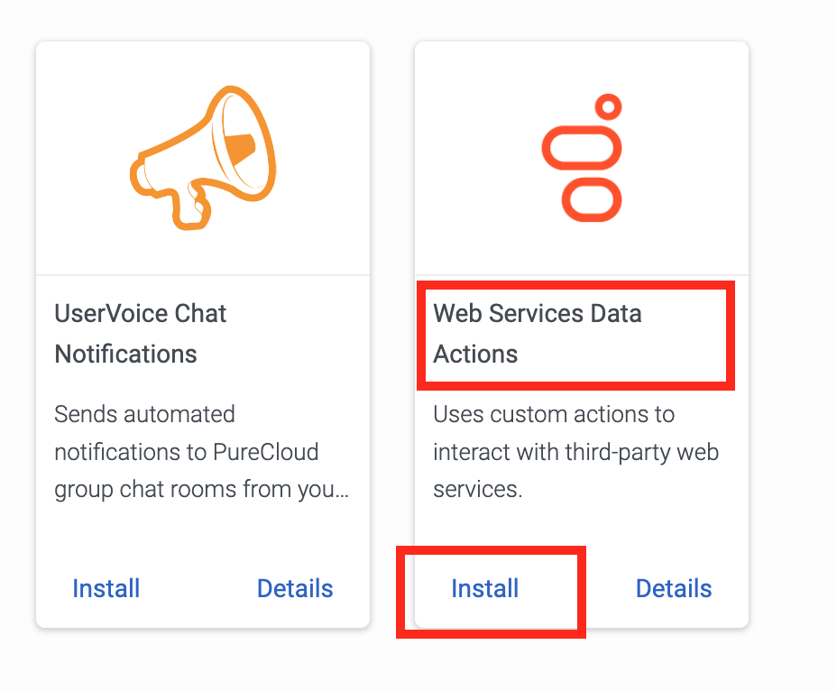
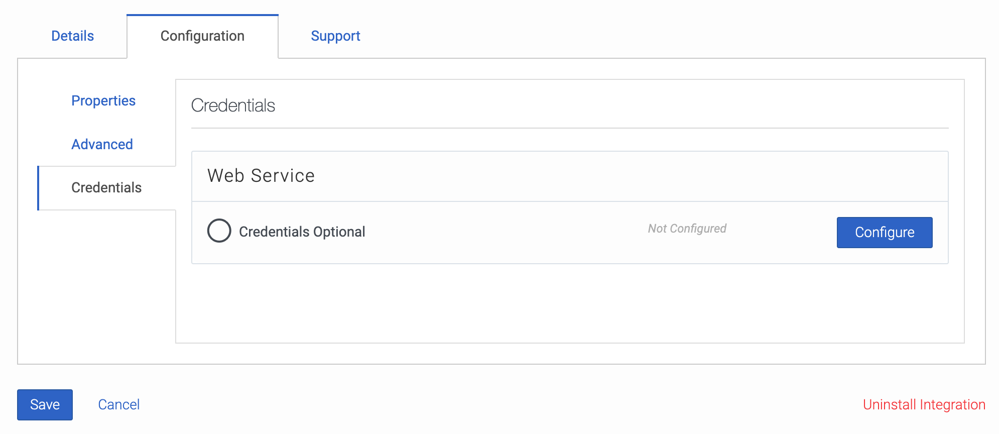

This Genesys Cloud Developer Blueprint integrates Genesys Cloud with an HRIS to retrieve employee time-off balances and provide that information in Genesys Cloud workforce management. When a time-off request is created or updated in Genesys Cloud workforce management, the integration inserts the request to the HRIS for tracking and verification against the employee's available balance.

You configure and run this integration from within your Genesys Cloud organization. The solution uses Architect flows and data actions to sync time-off data with your preferred HRIS. The following image shows an integration with BambooHR.

## About this Beta 1 solution

This Genesys Cloud Developer Blueprint is a beta solution that is intended for testing purposes only. The blueprint explains how to configure Architect flows and data actions so that you can set them up and test them within your own Genesys Cloud organization. Genesys Cloud workforce management will use the Architect flows and data actions that you set up in Beta 1 as part of Beta 2.  

## Solution components

* **Genesys Cloud CX** - A suite of Genesys cloud services for enterprise-grade communications, collaboration, and contact center management. This solution uses Genesys Cloud Architect, integrations and data actions to sync time-off request and time-off balances with the HRIS.
* **3rd-party HRIS that supports JSON posts to a REST API endpoint** - The integration requires external API access from Genesys Cloud to an HRIS. This blueprint uses BambooHR as an example.

## Prerequisites

### Specialized knowledge

* Experience designing Architect flows
* Experience using the Genesys Cloud Platform API
* Experience with REST API authentication
* Experience with JSON requests
* An understanding of how to use data actions
* Experience with the HRIS you use with this solution, including its time-off features and its API

### HRIS account with API access

Configure an HRIS account to provide limited and secured access to its data through JSON-based REST APIs.

The integration with Genesys Cloud workforce management needs sufficient API access to complete the following tasks:
  * Get a list of configured time-off types
  * Get a list of agents whose time-off data is synced by the integration
  * Get an agent-unique key or ID within the HRIS
  * Map the email address of a user in the HRIS to the corresponding agent in Genesys Cloud
  * Retrieve the agent time-off balance on requested dates, for specific time-off types
  * Insert a time-off request for an agent
  * Modify and delete an agent time-off request that had been previously inserted

### Genesys Cloud account requirements

* One of the following Genesys Cloud licenses. For more information, see [Genesys Cloud Pricing](https://www.genesys.com/pricing) in the Genesys website.
  * Genesys Cloud CX 3
  * Genesys Cloud CX 1 WEM Upgrade 2
  * Genesys Cloud CX 2 WEM Upgrade 1
* The Master Admin role in Genesys Cloud. For more information, see [Roles and permissions overview](https://help.mypurecloud.com/?p=24360 "Opens the Roles and permissions overview article") in the Genesys Cloud Resource Center.

For more information, see [Roles and permissions overview](https://help.mypurecloud.com/articles/about-roles-permissions/) in the Genesys Cloud Resource Center.

## Solution architecture

This solution is based on Architect flows, which Genesys Cloud workforce management starts. The flows use data actions to get or modify HRIS data. You can also build additional logic in the flows to manipulate HRIS data however you like.

Data actions use credentials that are stored in the integration's configuration to get authorization from the HRIS to access the specified route of the HRIS JSON REST API endpoint.

### Example Architect flows

The integration provides the following example Architect flows:

* [HRIS-Get-Agents flow](#hris-get-agents-flow "Goes to the HRIS-Get-Agents flow section")
* [HRIS-Get-Timeoff-Types flow](#hris-get-timeoff-types-flow "Goes to the HRIS-Get-Timeoff-Types section")
* [HRIS-Get-Balance flow](#hris-get-balance-flow "Goes to the HRIS-Get-Balance flow section")
* [HRIS-Insert-TimeOff flow](#hris-insert-timeoff-flow "Goes to the HRIS-Insert-TimeOff flow section")
* [HRIS-Update-TimeOff flow](#hris-update-timeoff-flow "Goes to the HRIS-Update-TimeOff flow section")

:::primary
**Note** You can update these flows as needed for your specific business purposes.
:::

### HRIS-Get-Agents flow

This flow gets a list of all agent records, including their corresponding IDs/keys and email addresses from the HRIS. Genesys Cloud workforce management requires this data in order to retrieve time-off balances and insert time-off requests for an agent into the HRIS.

This flow is optional. Alternatively, you could manually enter an agent's ID and email address into Genesys Cloud workforce management.

### HRIS-Get-Timeoff-Types flow

This flow gets a list of all time-off types from the HRIS. Time-off type information consists of its ID/key, name, and an optional secondary ID.
Genesys Cloud workforce management passes this info back to the HRIS when it checks an agent's time-off balance or when it inserts or modifies a time-off request.

You can use the optional secondary ID when a single ID does not sufficiently identify a time-off type and its accrual rule in the HRIS. The optional secondary ID can also store any additional information about the time-off type.

If secondary id is returned, Genesys Cloud workforce management also passes it back to the HRIS when it checks an agent's time-off balance or when it inserts or modifies a time-off request.

### HRIS-Get-Balance flow

This flow gets a list of the time-off balances for an agent. It retrieves balance information for multiple time-off types and multiple days.

### HRIS-Insert-TimeOff flow

This flow gets inserts a new time-off request into the HRIS. The request contains the following information:

* Agent ID
* A flag (true/false) to override the balance threshold
* Earliest time-off request date
* Latest time-off request date
* Average amount of time-off minutes (hours) per time-off day
* List of time-off days containing a date
* Amount of time-off minutes per day

:::primary
**Note**
Genesys Cloud workforce management propagates only approved time-off requests.
:::

If agents cannot exceed certain balance thresholds in the HRIS, and the flag to override the threshold is set to false, this flow should check that threshold as well. In this case, it may need to invoke a separate data action.

### HRIS-Update-TimeOff flow

This flow updates an existing time-off record in the HRIS when the corresponding information changes in WFM. The request contains the following information:

* Agent ID
* HRIS time-off request ID
* A flag (true/false) to override the balance threshold
* New time-off status
* Earliest time-off request date
* Latest time-off request date
* Average amount of time-off minutes (hours) per time-off day
* List of time-off days containing a date
* Amount of time-off minutes per day

:::primary
**Note** In the HRIS, the time-off request ID could change depending on whether the HRIS updates an existing record or replaces it with a new record.
:::

### Example data actions

The integration provides the following example data actions:

* **Bamboo-Get-TimeOff-Types** - This data action gets the list of time off types from the HRIS.
* **Bamboo-Get-Employees** - Gets the list of employees from the HRIS.
* **Bamboo-Get-TimeOff-Estimates** - Gets the estimated available time-off balance for an employee in the HRIS.
* **Bamboo-Put-TimeOff-Request** - Inserts the time-off request from Genesys Cloud into the HRIS. This data action is used by both the ### HRIS-Insert-TimeOff flow and the HRIS-Update-TimeOff flow.

:::primary
**Note** After you import these data actions into Genesys Cloud, you can update them as needed for your specific business purposes.
:::

## Implementation steps

### Clone the GitHub repository

:::primary
**Note**: Clone the GitHub repository only if you intend to use the example flows and data actions, which are built to integrate with BambooHR HRIS. If you are integrating with another HRIS, either modify the example files or skip this step entirely and create your own flows and data actions directly in your Genesys Cloud organization.
:::

Clone the [wfm-hris-blueprint](https://github.com/GenesysCloudBlueprints/wfm-hris-blueprint) repository to your local machine. The examples folder contains the Architect flows that you can modify as needed.

### Create the integration

To enable communication from Genesys Cloud to your HRIS, add a web services data actions integration:

1. In Genesys Cloud, navigate to **Admin** > **Integrations** and install a **Web Services Data Actions** integration from Genesys Cloud. For more information, see [About the data actions integrations](https://help.mypurecloud.com/?p=209478 "Opens the data actions overview article") in the Genesys Cloud Resource Center.

  

2. Rename the web services data action and provide a short description.
3. Click **Configuration** > **Credentials** and then click **Configure**.

   

4. From the **Credential Type** list, select **User Defined (OAuth)** and configure the credentials access your HRIS.
5. Click **Save**.

### Create the data actions

This solution provides [example data actions](#example-data-actions "Goes to the Example data actions section"). Data actions make JSON API calls to the HRIS. Each data action is configured for a specific API route and exchanges specific HRIS data.

Repeat the following instructions for each of these data actions, or for the new data actions that you create for your HRIS.

:::primary
**Note**
The following instructions illustrate generally how to use the example data actions that are provided with this blueprint solution. Your configuration steps will be specific to your HRIS.
:::

1. In Genesys Cloud, navigate to **Admin** > **Integrations** > **Actions**.
2. Do one of the following:
  * To use an example data action, click **Import**.
  * To create a new data action, click **Add**.

  
3. Select the data action file from your local copy of the repository.
4. For the Integration name, use the name of the [web services data actions integration that you created in the previous step](#create-the-integration "Goes to the Create the integration section").
5. In the **Action Name** field, specify a meaningful name.
6. Click **Setup** and configure the **Contracts** and **Configuration** sections. Note that the **Contracts** section has input and output contracts your flows use.
7. Click **Publish Data Action**.

For more information, see [About the web services data actions integration](href='https://help.mypurecloud.com/?p=127163' "Goes to the About the web services data actions integration article") in the Genesys Cloud Resource Center.

### Import the Architect flows

This solution provides [example Architect flows](#Example-architect-flows "Goes to the Example Architect flows section"), which you need to import into your Genesys Cloud organization.

:::primary
**Note**: After you add and import an example flow, you can modify it as necessary.
:::

1. In Genesys Cloud, navigate to **Admin** > **Architect**.
2. From the **Flows** list, select Workflow.

3. Click **Add**.
4. Specify a name and description that correspond to the example flow you are importing.

5. Click **Create**.
6. Click **Import** and select the example workflow that you are importing.

7. Make any necessary changes.
8. Save and publish the flows.

For more information, see [About Architect](href='https://help.mypurecloud.com/?p=53682 "Goes to the About Architect article") and [Work with workflows](href='https://help.mypurecloud.com/?p=215071 "Goes to the Work with workflows article") in the Genesys Cloud Resource Center.

## Test the workflows with the Genesys Cloud API

Test your published flows with Genesys Cloud public API calls. You can use curl as a client to call an API, or you can use your preferred method.

1. Authenticate your client and get a bearer token to be able to call an API. For more information, [Grant - Authorization Code](https://developer.genesys.cloud/authorization/platform-auth/use-authorization-code "Goes to the Grant - Authorization Code page").
2. Use the following API calls to view a flow, execute a flow, and get the execution results:
  * [GET /api/v2/flows/{flowId}](https://developer.genesys.cloud/routing/architect/#get-api-v2-flows--flowId-) to check a configured flow
  * [POST /api/v2/flows/executions](https://developer.genesys.cloud/routing/architect/#post-api-v2-flows-executions) to pass input parameters and start flow execution
  * [GET /api/v2/flows/executions/{flowExecutionId}](https://developer.genesys.cloud/routing/architect/#get-api-v2-flows-executions--flowExecutionId-) to check flow execution status and get results

  For more information, go to the [Architect APIs section](https://developer.genesys.cloud/routing/architect/) of the Genesys Cloud API Explorer.

## Additional resources

* [wfm-hris-blueprint repository](https://github.com/GenesysCloudBlueprints/wfm-hris-blueprint) in GitHub
